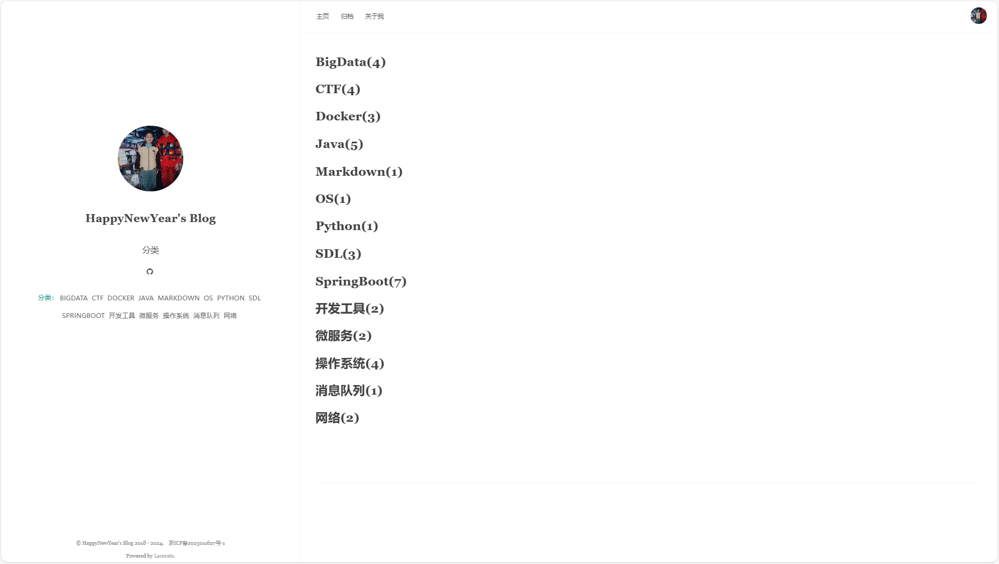
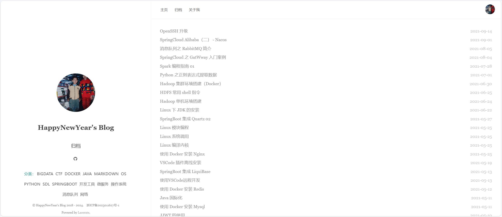
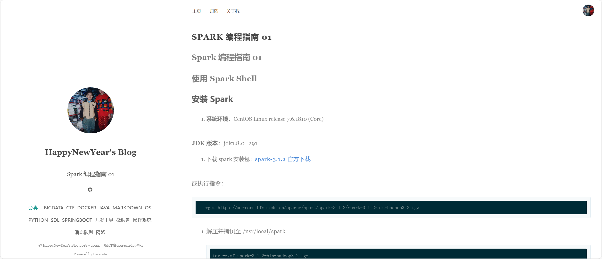
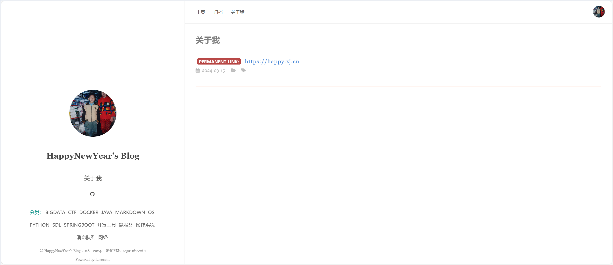

<div align="center">
  <a href="https://happy.zj.cn/">
    
  </a>
  <h1 align="center">
    Lacerate
  </h1>
  <h3 align="center">
    一个Goland编写的简单的静态博客生成器
  </h3>

[下 载](https://github.com/Foleyzhao/lacerate/releases) | [主 页](https://happy.zj.cn/)

  <a href="https://github.com/Foleyzhao/lacerate/releases/latest">
    
  </a>

  <a href="https://github.com/Foleyzhao/lacerate/master/LICENSE">
    
  </a>

  <a href="https://github.com/Foleyzhao/lacerate/releases/latest">
    
  </a>

</div>
<br>
<div align="center">
  
</div>
<br>

👏  欢迎使用 **Lacerate** ！

✍️  **Lacerate** 一个简单的静态博客生成器。

## 特性👇

📝  使用 **Markdown** 语法，进行快速创作

🌉  对文章进行分类

🏷️  对文章进行标签分组

📋 根据年月进行文章归档

🌁  自定义关于我页面

💻  支持多客户端: **𝖶𝗂𝗇𝖽𝗈𝗐𝗌** / **𝖬𝖺𝖼𝖮𝖲** / **Linux**

## 教程
[配置文件说明](../doc/配置文件说明.md) | 
[博客编写指南](../doc/博客编写指南.md)

### 快速启动

```bash
git clone https://github.com/Foleyzhao/lacerate.git

go build -o lacerate ./cmd/cmd.go

nohup ./lacerate run > lacerate.log 2>&1 &
```
访问: http://localhost:8090/ 

### 详细指令

```bash
# lacerate command [args...]

# 初始化博客文件夹
lacerate init

# 新建 markdown 文件
lacerate new filename

# 编译博客
lacerate compile/c
    
# 打开文件监听器
lacerate watch/w

# 运行http服务，默认端口8090
lacerate http [port]
    
# 运行lacerate，默认端口8090
lacerate run [port]
```

## 联系
[主页](https://happy.zj.cn/) | 邮箱: foleyzhao@163.com

## 示例截图
<div align="center">
  
</div>
<br>
<div align="center">
  
</div>
<br>
<div align="center">
  
</div>
<br>
<div align="center">
  
</div>
<br>
<div align="center">
  
</div>

## 贡献
欢迎任何形式的贡献。可以使用 [pull requests](https://github.com/Foleyzhao/lacerate/pulls) 或 [issues](https://github.com/Foleyzhao/lacerate/issues) 的方式提交任何想法。

## 支持
<div>
  
</div>

## License
[Apache-2.0](https://github.com/Foleyzhao/lacerate/LICENSE). Copyright (c) 2024 Lacerate
